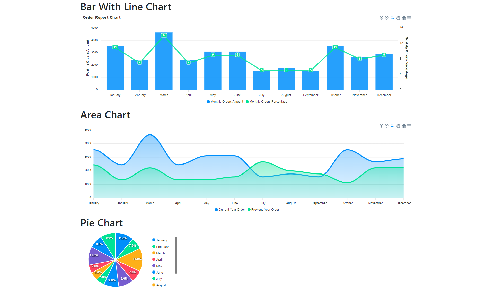

## About Laravel, PHP And Apex Chart Version

-   [Laravel Version 10.21](https://laravel.com).
-   [PHP Version 8.1](https://php.net).
-   [Apex Chart](https://apexcharts.com/docs/installation/).

## How to clone.
Just copy the following command and past into your terminal.

    $ git clone https://github.com/ArifulSikder/laravel-apex-chart.git

After complete cloning, open your project directory. just run the following command.

    cd laravel-apex-chart

Then run the following command.

    composer update

For run your project simply run the following command.

    php artisan serve

Opps! You got some database related errors. You you need to make database connection. Connect to the database and from the projects main directory, there is a folder called "sql". From this folder import database called "chart.sql".

After import database you will get the charts. 

## Contact:
If you have any issues, please contact me by sending message:

1. Facebook: [https://facebook.](https://www.facebook.com/arifulsikderr/)
2. Email: [https://email.](mdislamnoyon3@gmail.com)
3. linkedin: [https://linkedin.](https://www.linkedin.com/in/arifulsidkerr/)

## License

The Laravel framework is open-sourced software licensed under the [MIT license](https://opensource.org/licenses/MIT).
